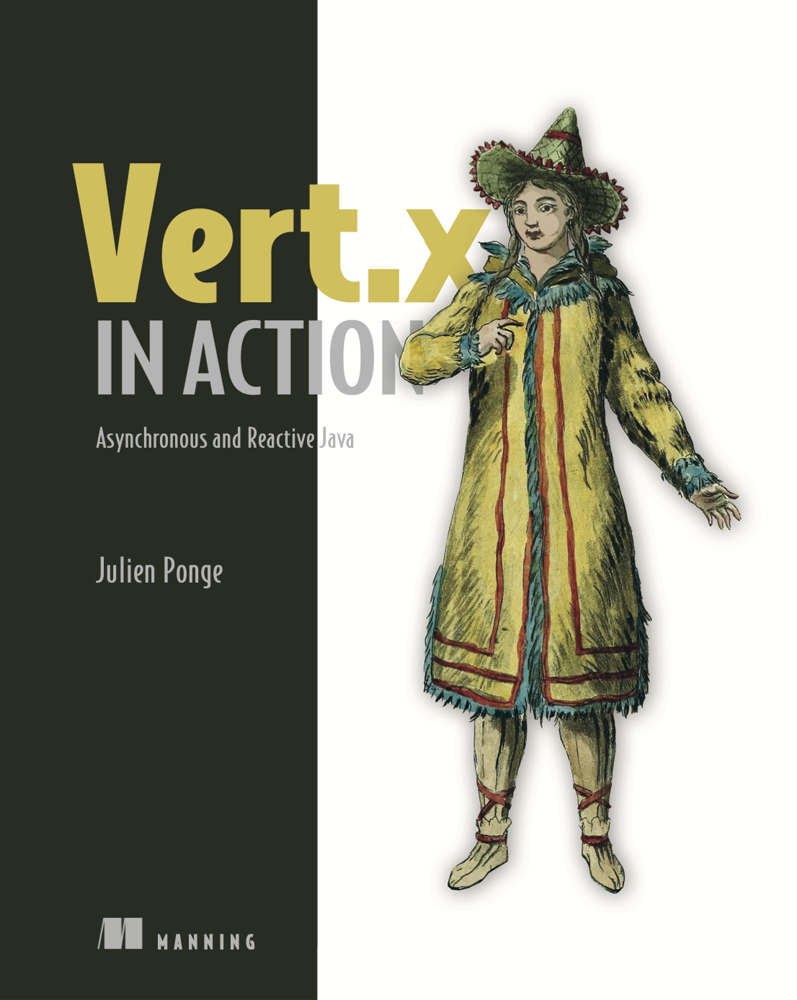

I am a **Director and Senior Principal Software Engineer (Red Hat)** at [IBM](https://www.ibm.com/), based in [Lyon, France](https://en.wikipedia.org/wiki/Lyon).

As an _individual contributor_, I focus on **reactive systems and Java-based cloud-native technologies**, contributing primarily to [Quarkus](https://quarkus.io), [Mutiny](https://smallrye.io/smallrye-mutiny/), and [Eclipse Vert.x](https://vertx.io).

I am the author of [*Vert.x in Action – Asynchronous and Reactive Java*](https://www.manning.com/books/vertx-in-action), published by Manning:

Before joining IBM through Red Hat, I was an **Associate Professor of Computer Science and Engineering** at [INSA Lyon](http://www.insa-lyon.fr/) and the [CITI Laboratory](http://www.citi-lab.fr/), where I held several teaching, research, and leadership roles.

My long-standing engagement in the Java community earned me recognition as a [Java Champion](https://javachampions.org/).

## Professional experience 👨🏻‍💻

* **Since September 2025** — *Director, Senior Principal Software Engineer (Red Hat)*, **IBM**
* **April 2024 – August 2025** — *Senior Principal Software Engineer*, **Red Hat**
* **October 2018 – March 2024** — *Principal Software Engineer*, **Red Hat**
* **September 2016 – August 2018** — *Delegation to Red Hat* through INSA Lyon, contributing to [Eclipse Vert.x](https://vertx.io/)
* **2009 – 2018** — *Associate Professor* (tenured) and *Researcher*, **INSA Lyon – CITI Laboratory**
* **2016 – 2017** — *Scientific Deputy Manager*, [Spie ICS – INSA Lyon IoT Chair](http://www.citi-lab.fr/chairs/iot-chair/)
* **2014 – 2017** — *Deputy Director*, **CITI Laboratory** – Industry and society relations
* **2012 – 2017** — *Manager*, [IST program](http://telecom.insa-lyon.fr/ist), **INSA Lyon**
* **2011 – 2015** — *Contracting Technical Writer*, **Oracle Corporation**
* **2004 – 2009** — *Researcher and Lecturer*, **Clermont-Auvergne University (ISIMA)** and the **University of New South Wales**
* **2003** — *Intern*, **Michelin**, Software Methods and Tools Group

## Open source contributions ✨

* [**Mutiny**](https://smallrye.io/smallrye-mutiny/) — Reactive programming library for Java. *Maintainer.*
* [**Eclipse Vert.x**](https://vertx.io/) — Reactive toolkit for the JVM. *Core developer and maintainer.*
* [**Quarkus**](https://quarkus.io) — Kubernetes-native Java stack for cloud environments. *Developer.*
* [**Eclipse Golo**](https://golo-lang.org/) — Dynamic JVM language. *Creator.*
* [**JooFlux**](https://github.com/dynamid/jooflux) — Dynamic aspect injection and live method patching for Java. *Co-creator.*
* [**IzPack**](http://izpack.org/) — Cross-platform software installer. *Founder (retired).*

## Selected publications 📚

These works highlight key aspects of my research and open source journey.  
For a full list, visit my [publications page](/academia/publications/).

* Julien Ponge, Arthur Navarro, Clément Escoffier, and Frédéric Le Mouël. **Analysing the Performance and Costs of Reactive Programming Libraries in Java.** *REBLS ’21, ACM SIGPLAN International Workshop on Reactive and Event-Based Languages and Systems*, 2021. [DOI](https://doi.org/10.1145/3486605.3486788) [PDF](/files/publications/reactive-libraries-rebls21.pdf)
* Julien Ponge and Mark Little. **Scalability and resilience in practice: current trends and opportunities.** *SRDS 2019*, Lyon, France. [PDF](/files/publications/srds-jpml19.pdf)
* Stefan-Gabriel Chitic, Julien Ponge, and Olivier Simonin. **SDfR – Service Discovery for Multi-Robot Systems.** *ICAART 2016*, Rome, Italy. [HAL entry](https://hal.inria.fr/hal-01286895)
* Julien Ponge, Frédéric Le Mouël, and Nicolas Stouls. **Golo: a Dynamic, Light, and Efficient Language for the Post-InvokeDynamic JVM.** *PPPJ’13*, Stuttgart, Germany. [DOI](http://dx.doi.org/10.1145/2500828.2500844) [PDF](/files/publications/golo-pppj13.pdf)
* Julien Ponge, Boualem Benatallah, Fabio Casati, and Farouk Toumani. **Analysis and Applications of Timed Service Protocols.** *ACM Transactions on Software Engineering and Methodology*, 2010. [DOI](http://dx.doi.org/10.1145/1734229.1734230)

## PhD supervision 👨‍🔬 👩‍🔬

* **Arthur Navarro** (since 2022, [Red Hat Research](https://research.redhat.com/)) — *Characterizing and optimizing reactive systems: a language-runtime continuum*  
* **Patrik Fortier** (defended 2024, INSA Lyon / Spie ICS IoT Chair) — *Programming language abstractions for the Internet of Things*  
* **Stefan-Gabriel Chitic** (defended 2018, French Ministry Grant) — *Middleware and programming models for multi-robot systems*.

## Education 🎓

* **🇦🇺 PhD (under cotutelle agreements)**, [University of New South Wales](https://www.unsw.edu.au/), 2008 — *Supervised by Boualem Benatallah*  
* **🇫🇷 PhD**, [Clermont-Auvergne University](https://www.uca.fr), 2008 — *Supervised by Farouk Toumani*  
* **🇫🇷 Master’s**, [Clermont-Auvergne University](https://www.uca.fr), 2004  
* **🇫🇷 Bachelor’s**, [Clermont-Auvergne University](https://www.uca.fr), 2002  
* **🇫🇷 High School Diploma**, [Lycée Alain Colas](http://lyc58-colas.ac-dijon.fr), Nevers, 1999
