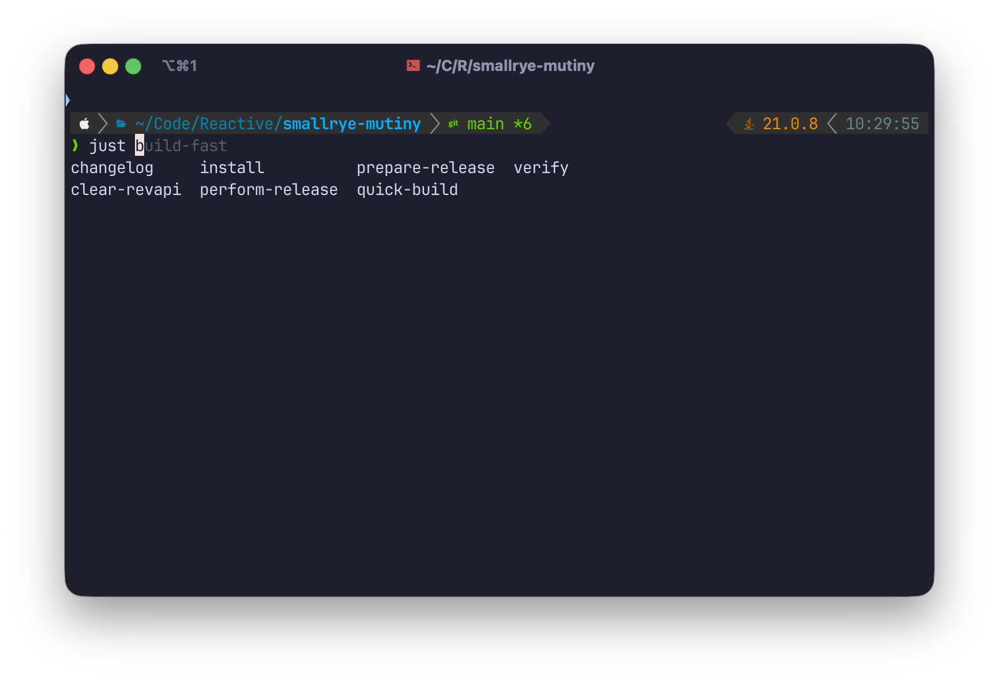

I have been aware of the [Fish shell](https://fishshell.com/) for many years.
I think I first tried it around 2009.

Fish is a very developer friendly shell, and I have tried it on and off, but I never managed to make the plunge and have it as my daily driver, despite recommendations from people with a good sense of taste like [François Lesueur](https://flesueur.tuxlab.net/index.php?lang=en).

Fast forward 2025, and I have decided to _finally_ move over to Fish.

## What's wrong with Zsh?

First of all, I have to say that [Zsh](https://www.zsh.org/) is an excellent shell.
It is much better than Bash, and projects like [Oh My Zsh](https://ohmyz.sh/) make it so much easier to configure.

My Zsh configuration was very fine with _cool_ stuff like:

- [zsh-autosuggestions](https://github.com/zsh-users/zsh-autosuggestions) to provide automatic suggestions, just like... what Fish does out of the box,
- [zsh-syntax-highlighting](https://github.com/zsh-users/zsh-syntax-highlighting) to provide syntax highlighting, again, to copy what Fish already does,
- [Starship](https://starship.rs/), a very cool prompt that works for almost any shell, including Fish and Zsh.

Note that while Fish cannot run Bash or Zsh scripts because it has a different syntax, your existing scripts remain safe because they are supposed to have a [_shebang_](https://en.wikipedia.org/wiki/Shebang_(Unix)) so they run on the intended shell.
There are also Fish utilities like [Bass](https://github.com/edc/bass) if you need to capture side effects of Bash / Zsh scripts back in Fish (e.g., virtual environment managers using fancy tricks).

## What does your shell looks like?

It looks like this:



I am using the [Tide prompt](https://github.com/IlanCosman/tide) instead of Starship, although Starship is absolutely great and compatible with Fish.

## Is it hard to port a Zsh configuration to Fish?

The first thing you need to to is to [read the tutorial](https://fishshell.com/docs/current/tutorial.html) and [the documentation](https://fishshell.com/docs/current/index.html).
[Fish for bash users](https://fishshell.com/docs/current/fish_for_bash_users.html#fish-for-bash-users) is also a good starting point.

Porting your configuration to Fish is quite easy once you understand how configuration is structured, and how Fish scripting works.

### Structure of the configuration folder

The Fish configuration is in `~/.config/fish`, with a very effective structure:

- `completions/` holds some shell completion functions you may need
- `conf.d/` holds Fish scripts that are being loaded when the shell starts: this is a good place to define environment variables, aliases, or abbreviations (more on it later)
- `config.fish` is the main entry point, but I personally prefer files in `conf.d/` over putting configuration in this file
- `functions/` holds _function definitions_: it is a good practice to define functions in files there (e.g., `functions/yolo.fish` for a `yolo` function) rather than in `conf.d/` or `config.fish`, because they will be loaded on demand
- `themes/` holds... custom themes.

### Environment variables, abbreviations and aliases

As an example, here is one of my configuration file in `~/.config/fish/conf.d/general.fish`:

```fish
set -xg LC_ALL en_US.UTF-8
set -xg LANG en_US.UTF-8

set -xg EDITOR nvim
abbr vi nvim
abbr vim nvim

fzf --fish | source

abbr cat bat
set -xg BAT_THEME ansi
set -xg BAT_STYLE plain

alias l "eza --color-scale --color auto --color-scale-mode=fixed --sort Name"
alias ll "eza --color-scale --color auto --color-scale-mode=fixed --sort Name --long"
alias la "eza --color-scale --color auto --color-scale-mode=fixed --sort Name --long --all"
alias lr "eza --color-scale --color auto --color-scale-mode=fixed --sort Name --long --recurse"
alias lra "eza --color-scale --color auto --color-scale-mode=fixed --sort Name --long --recurse --all"
alias lt "eza --color-scale --color auto --color-scale-mode=fixed --sort Name --long --tree"
alias lta "eza --color-scale --color auto --color-scale-mode=fixed --sort Name --long --tree --all"
alias ls "eza --color-scale --color auto --color-scale-mode=fixed --sort Name"
alias tree "eza --color-scale --color auto --color-scale-mode=fixed --sort Name --tree"
```

Here's what you need to know if you aren't familiar with Fish yet:

- `set -xg` defines an _exported_, _global_ environment variable,
- `abbr` defines abbreviations, so when I type `vi`, Fish replaces it in the prompt with `nvim`,
- `alias` is a shortcut to define _functions_ that are similar to abbreviations (`abbr`), but instead there is no replacement in the prompt, so `ls` remains `ls` and not `eza --color-scale --color auto --color-scale-mode=fixed --sort Name` as `abbr` would have done.

### Defining functions

Here is a function called `rss`, defined in `~/.config/fish/functions/rss.fish`, and that can be used to print the [Resident set size](https://en.wikipedia.org/wiki/Resident_set_size) of certain processes:

```fish
function rss -a target
  pgrep $target | xargs ps -o pid,rss,command -p | awk '{$2=int($2/1024)"M";}{ print;}'
end
```

The syntax is quite straightforward.
Note that `-a` is used to defined arguments.

### Conditionals

My configuration file in `~/.config/fish/conf.d/kube.fish` uses conditionals to first check if `kubectl` is here, then loads the completion helpers and defines a few abbreviations:

```fish
if type -q kubectl
    kubectl completion fish | source

    abbr k "kubectl"
    abbr ka "kubectl apply -f"
    abbr kd "kubectl delete -f"
    abbr kgp "kubectl get pods"
    abbr kgs "kubectl get services"
end
```

As you will see, most popular tools provide Fish completion support just like they do for Bash and Zsh.

## Noteworthy tips

While most of the migration path was easy, I had a few extra things to do along the way.

### Setting Fish as the default shell

There is a good chance that Fish is not in `/etc/shells`, so you need to add it before you can change your default shell with `chsh`.

Here is a Fish script to fix that:

```fish
#!/usr/bin/env fish
set path_to_fish (which fish)
echo $path_to_fish | sudo tee -a /etc/shells
chsh -s $path_to_fish
```

### Fisher as a plugin manager, and the case of SDKMAN

I don't need many plugins, but as a user of [SDKMAN!](https://sdkman.io/) to manage my Java environments and tools, I quickly realized that SDKMAN! did not support Fish.
There is fortunately a fix: [sdkman-for-fish](https://github.com/reitzig/sdkman-for-fish)

The first thing is to install the [fisher plugin manager](https://github.com/jorgebucaran/fisher), then add the SDKMAN! plugin:

```fish
brew install fisher
fisher install reitzig/sdkman-for-fish@v2.1.0
```

### Tide prompt

Choosing a prompt is a personal preference, and as mentionned above I went with [tide](https://github.com/IlanCosman/tide) (but again, [Starship](https://starship.rs/) is still great).

The cool thing with `tide` is that it loads _fast_ because it takes advantage of asynchronous prompt definitions.
If loading `git` information from your current folder takes time because it is a big repository, then `tide` won't block the prompt, the `git`-related information will appear when it is ready.

You can get `tide` using `fisher`:

```fish
fisher install IlanCosman/tide@v6
```

You can run `tide configure` to interactively customize the prompt to your liking.
You can also record the command-line that corresponds to your final preferences, so you can re-use it in scripts.
My current configuration can be reproduced with:

```fish
#!/usr/bin/env fish
tide configure --auto --style=Classic \
    --prompt_colors='True color' \
    --classic_prompt_color=Dark \
    --show_time='24-hour format' \
    --classic_prompt_separators=Angled \
    --powerline_prompt_heads=Sharp \
    --powerline_prompt_tails=Flat \
    --powerline_prompt_style='Two lines, character' \
    --prompt_connection=Disconnected \
    --powerline_right_prompt_frame=No \
    --prompt_spacing=Sparse \
    --icons='Many icons' \
    --transient=No
 ```

## References

A few blog posts have been useful when I planned my migration from Zsh to Fish.

[The Fish documentation is excellent](https://fishshell.com/), but blog posts always provide interesting notes and perspectives.

In my case I recommend reading these:

- https://samedwardes.com/blog/2025-07-03-from-zsh-to-fish/
- https://www.joshfinnie.com/blog/moving-from-oh-my-zsh-to-starship-and-fish-shell/
- https://www.hardscrabble.net/2025/fish-shell/ 
