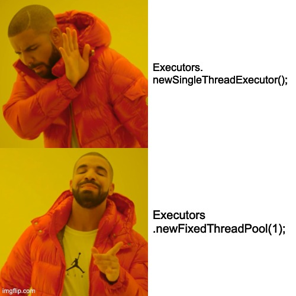

I was recently puzzled by flaky tests in [Mutiny](https://smallrye.io/smallrye-mutiny/).

## The problem

Once in a while we would get build failures in _GitHub Action_ runners, and of course we could not reproduce them locally.
Even repeating a test a thousand times would not reproduce the failure seen in the runners.
And of course, there was not much determinism in which test could fail.

Still, the logs would hint at tasks being rejected by terminated Java executors, so I started digging.
I went through the usage of executors in tests, but aside from a few trivial fixes, all executors were being used as they should be, as in:

```java
// Get an executor
var executor = Executors.newFixedThreadPool(4);

// Do stuff
doThingsWith(executor);

// Shut it down
executor.shutdownNow();
```

## The [Eureka](https://en.wikipedia.org/wiki/Eureka_(word)) moment

I then started tracking calls to `shutdown()` and `shutdownNow()`, to try and see if we had some code, somewhere, that would shut an executor down.
Nothing in tests, but I eventually found a call to `shutdown` in that class from the JDK:

```java
static class FinalizableDelegatedExecutorService
    extends DelegatedExecutorService {
    FinalizableDelegatedExecutorService(ExecutorService executor) {
        super(executor);
    }
    protected void finalize() {
        super.shutdown();
    }
}
```

Guess what?

This class is used by... `Executors.newSingleThreadExecutor()`!

```java
public static ExecutorService newSingleThreadExecutor() {
    return new FinalizableDelegatedExecutorService
        (new ThreadPoolExecutor(1, 1,
                                0L, TimeUnit.MILLISECONDS,
                                new LinkedBlockingQueue<Runnable>()));
}
```

So if you create an executor using `newSingleThreadExecutor()`, then the actual executor is being wrapped in a class whose sole purpose is to call `shutdown()` in a _finalizer_.

See the first paragraph of the documentation of the (now-deprecated!) [`Object.finalize()` method](https://docs.oracle.com/en/java/javase/11/docs/api/java.base/java/lang/Object.html#finalize()):

> Called by the garbage collector on an object when garbage collection determines that there are no more references to the object. 
> A subclass overrides the finalize method to dispose of system resources or to perform other cleanup.

It is to be expected that in a constrained environment such as that of a CI/CD runner, the garbage collector has to run more frequently than on a 32Gb of RAM laptop.
Depending on how your code is written, you may end up in cases where an executor gets _finalized_ before it has received all tasks and they get rejected.

## The fix, and a bit of caution

In the case of Mutiny tests flakiness was greatly reduced by replacing calls of:

```java
var executor = Executors.newSingleThreadExecutor();
```

with:

```java
var executor = Executors.newFixedThreadPool(1);
```

Indeed `newSingleThreadExecutor()` is the sole method that wraps executors with `FinalizableDelegatedExecutorService`.

Now should you do the same to your code base and ditch `newSingleThreadExecutor()`? 

I don't think so!

1. Make sure that you manage executors _correctly_, and especially that you don't forget to shut them down.
   This is especially important in test suites because you could be creating lots of them.
2. As a general practice for new code I think it's a good idea to call `Executors.newFixedThreadPool(1)`, even if there's a method with the correct name for the purpose.
   At some point in future Java releases _finalizers_ will be gone and `Executors.newSingleThreadExecutor()` will have the same runtime behavior, but meanwhile you can avoid some potential headaches.
3. If you or your libraries use `Executors.newSingleThreadExecutor()` and you see weird task rejections then there's a good chance you hit the same problem!

