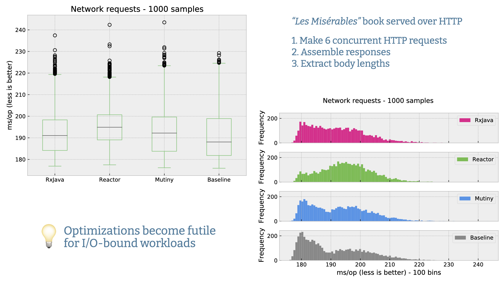
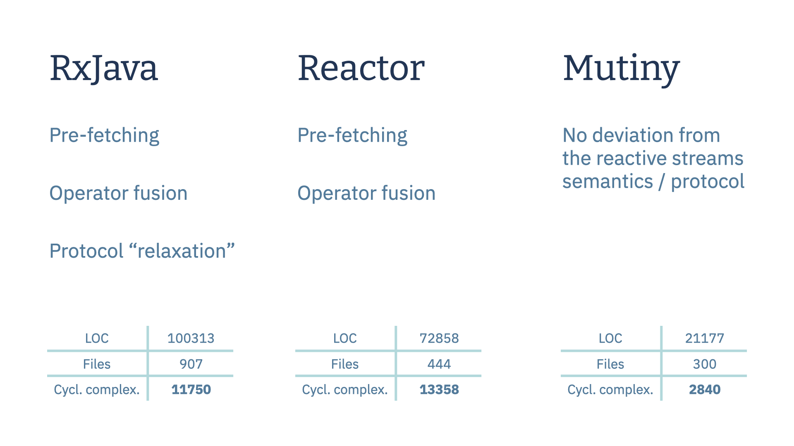
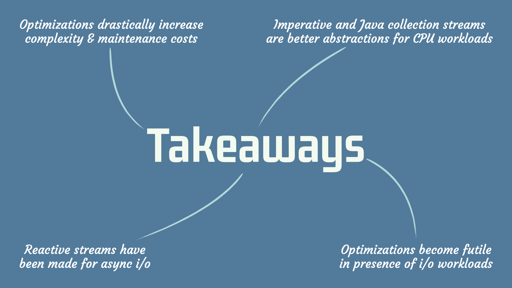

I presented today a new publication called [Analysing the Performance and Costs of Reactive Programming Libraries in Java](https://dl.acm.org/doi/10.1145/3486605.3486788) at the [8th ACM SIGPLAN International Workshop on Reactive and Event-Based Languages and Systems (REBLS)](https://2021.splashcon.org/home/rebls-2021) (a workshop of [Splash 2021](https://2021.splashcon.org/)).

This paper was co-authored with Arthur Navarro, Clément Escoffier and Frédéric Le Mouël.

## Abstract

> Modern services running in cloud and edge environments need to be resource-efficient to increase deployment density and reduce operating costs. Asynchronous I/O combined with asynchronous programming provides a solid technical foundation to reach these goals. Reactive programming and reactive streams are gaining traction in the Java ecosystem. However, reactive streams implementations tend to be complex to work with and maintain. This paper discusses the performance of the three major reactive streams compliant libraries used in Java applications: RxJava, Project Reactor, and SmallRye Mutiny. As we will show, advanced optimization techniques such as operator fusion do not yield better performance on realistic I/O-bound workloads, and they significantly increase development and maintenance costs.

## Reference

Julien Ponge, Arthur Navarro, Clément Escoffier, and Frédéric Le Mouël. 2021. **Analysing the Performance and Costs of Reactive Programming Libraries in Java**. *In Proceedings of the 8th ACM SIGPLAN International Workshop on Reactive and Event-Based Languages and Systems ([REBLS ’21](https://2021.splashcon.org/home/rebls-2021)), October 18, 2021, Chicago, IL, USA. ACM, New York, NY, USA, 10 pages.* [DOI](https://doi.org/10.1145/3486605.3486788) [PDF](/publications/reactive-libraries-rebls21.pdf)

## Excerpts

### I/O Bound Experimental Results

### Code bases compared

### Takeaways

