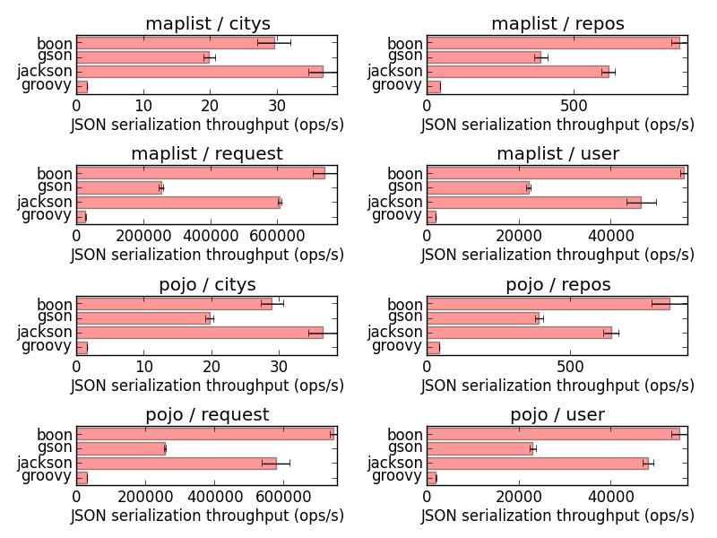
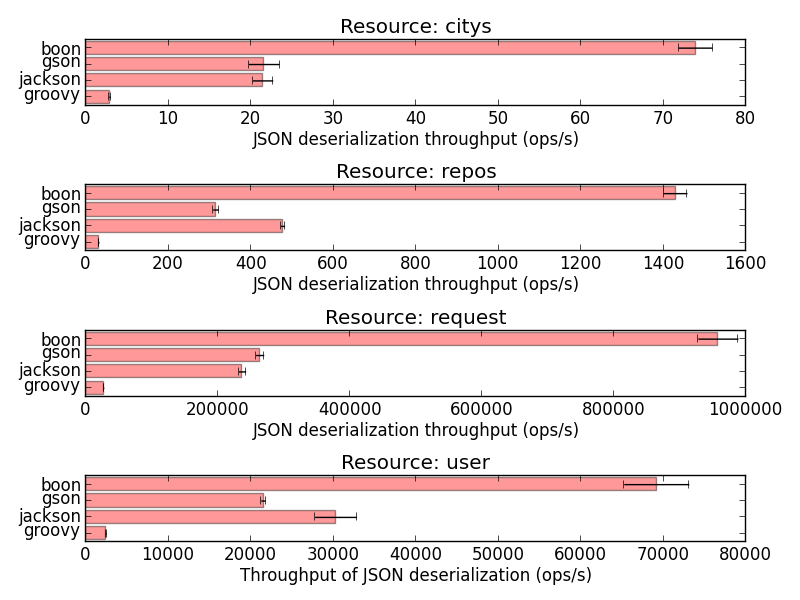
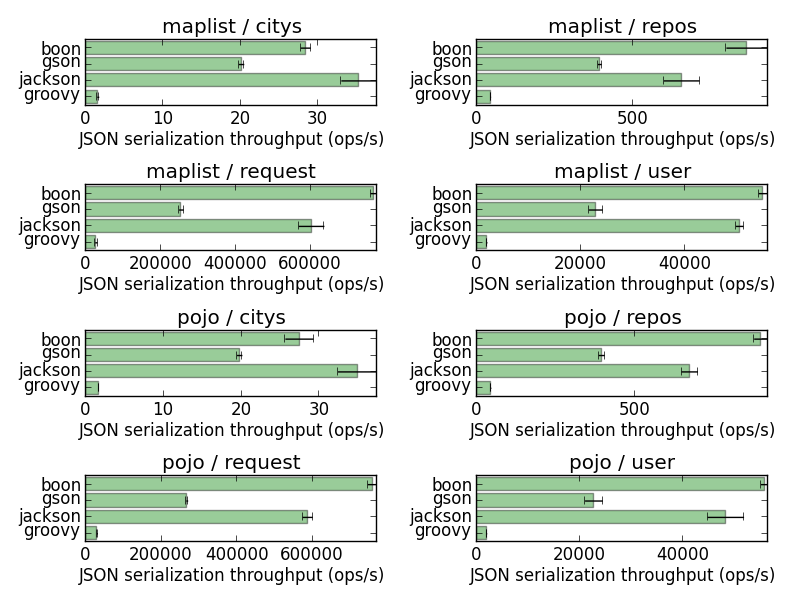
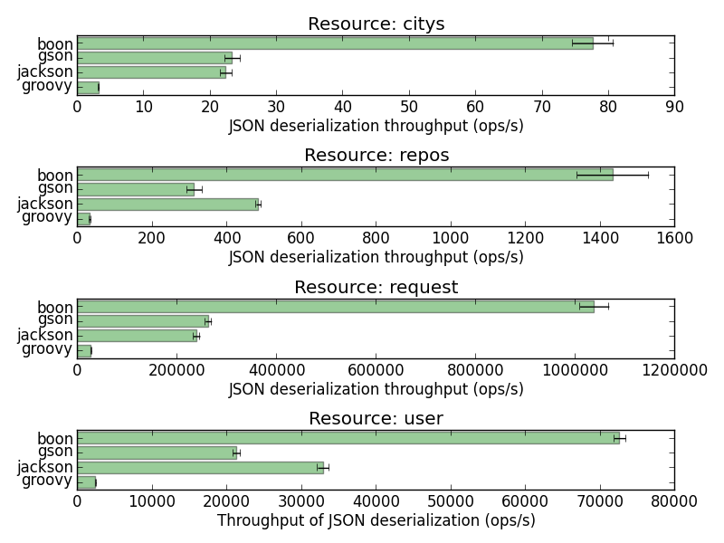
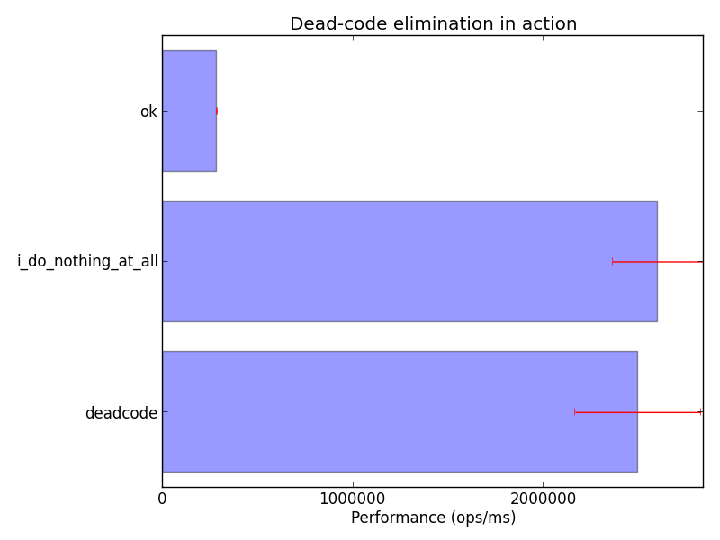

> **Update 2014/04/29:** for the record Boon is the new JSON implementation for Groovy. 
> `groovy` in the benchmarks actually refers to the old implementation.

Rick Hightower recently [published a JSON JVM libraries benchmark](http://rick-hightower.blogspot.fr/2014/04/groovy-and-boon-provide-fastest-json.html)
where his project [Boon](https://github.com/RichardHightower/boon/wiki) was the clear winner.

For some reason I ended up looking at [Andrey Bloschetsov's JSON benchmarks](https://github.com/bura/json-benchmarks).
I found a few mistakes in the way the benchmark was written, and here is how I revisited and fixed it.

**Spoiler alert:** the results are similar because the code under test is complex enough, but fixing
potential flaws never hurts.

## Initial measures

I started with the `master` branch of the benchmark suite, and ran the benchmark with the default
configuration.

The benchmark is written with [OpenJDK JMH](http://openjdk.java.net/projects/code-tools/jmh/), a solid
harness for writing benchmarks. With the results exported to a `.csv` file, I was able to plot the
results:





Results seem quite consistent and Boon is indeed faster than GSON, Jackson and the old Groovy built-in
JSON support (Boon is becoming the new Groovy built-in JSON implementation).

## What I fixed

Looking at the source code I found a few areas of improvement.

### Longer runs, better defaults

While JMH-built benchmark settings can always be tweaked from the command-line, I thought it would
be better to improve the default settings:

```diff
--- a/src/main/java/org/bura/benchmarks/json/DeserializationBenchmarks.java
+++ b/src/main/java/org/bura/benchmarks/json/DeserializationBenchmarks.java
@@ -33,6 +25,9 @@ import com.google.gson.reflect.TypeToken;
 @State(Scope.Benchmark)
 @BenchmarkMode(Mode.Throughput)
 @OutputTimeUnit(TimeUnit.SECONDS)
+@Fork(value = 1, jvmArgsAppend = {"-Xmx2048m", "-server", "-XX:+AggressiveOpts"})
+@Measurement(iterations = 10, time = 3, timeUnit = TimeUnit.SECONDS)
+@Warmup(iterations = 20, time = 3, timeUnit = TimeUnit.SECONDS)
 public class DeserializationBenchmarks {

     private static final String RESOURCE_CITYS = "citys";
```

_(a similar change was made to the `SerializationBenchmarks` class)_

Iterations are now longer than the default 1s, and we have more warmup rounds. I could not observe
much variation using different JVM instances, so a `fork` value of `1` is fine. It would be worth
having more forks if the resulting values were less contrasted.

I also set the JVM options and introduced `-XX:+AggressiveOpts`. Since we are doing flat out
benchmarking, why not just ask the JVM for that extra crazyness?

### Avoid (potential) dead-code elimination

HotSpot is clever. I mean, _really_ clever.

When it sees code with no side-effect, it simply removes it. I would recommend reading the
[list of optimization techniques](https://wikis.oracle.com/display/HotSpotInternals/PerformanceTechniques)
on the OpenJDK wiki to get a glimpse of what clever tricks HotSpot employs.

The benchmark code was full of potential dead-code eliminations:

```diff
@@ -65,29 +61,29 @@ public class DeserializationBenchmarks {
     private TypeReference<?> jacksonType;

     @GenerateMicroBenchmark
-    public void jackson() throws JsonParseException, JsonMappingException, IOException {
-        jacksonMapper.readValue(resource, jacksonType);
+    public Object jackson() throws IOException {
+        return jacksonMapper.readValue(resource, jacksonType);
     }

     private final Gson gson = new GsonBuilder().setDateFormat("yyyy-MM-dd'T'HH:mm:ssZ").create();
     private java.lang.reflect.Type gsonType;

     @GenerateMicroBenchmark
-    public void gson() {
-        gson.fromJson(resource, gsonType);
+    public Object gson() {
+        return gson.fromJson(resource, gsonType);
     }

     private final JsonParser boon = new JsonFastParser();

     @GenerateMicroBenchmark
-    public void boon() {
-        boon.parse(resource);
+    public Object boon() {
+        return boon.parse(resource);
     }

     private final JsonSlurper groovy = new JsonSlurper();

     @GenerateMicroBenchmark
-    public void groovy() {
-        groovy.parseText(resource);
+    public Object groovy() {
+        return groovy.parseText(resource);
     }
 }
```

I simply replaced `void` methods with value-returning methods. This way, JMH consumes the value
in a way that prevents HotSpot from thinking that the code in the method is useless. Another way
to do so is to push values into a JMH-injected `Blackhole` object.

Looking at other places in the benchmark source code, you could see that the author actually knew
about dead-code elimination:

```diff
     @GenerateMicroBenchmark
-    public void boon() {
-        String json = boon.serialize(data).toString();
-        json.charAt(0);
+    public String boon() {
+        return boon.serialize(data).toString();
     }
```

The call to `json.charAt(0)` was probably meant to ensure that the result value of `boon.serialize(...)`
was not going to considered as dead-code.

Aside from potential dead-code elimination, what is wrong here is that the benchmark was actually
not just about benchmarking `boon.serialize(...)`, but `boon.serialize(...)` *and* `json.charAt(0)`.

I did not check what native code HotSpot generated, but I suspect that the `json.charAt(0)` call
itself was subject to dead-code elimination: it's simple and free of side-effects.

## New measures

You can see all my changes as a pull-request:
[https://github.com/bura/json-benchmarks/pull/3](https://github.com/bura/json-benchmarks/pull/3).

The new plots do not show much difference:





## So what?

My fixes did not significantly change the figures, so what?

It turns out that the benchmark figures were good because the code under test for each library
was complex enough, and possibly with some side-effects.

This is typical of writing benchmarks rather than micro-benchmarks.

While HotSpot *did not* apply dead-code elimination, the way benchmark methods were written
*actually* made them *candidates* for dead-code elimination. With these simple fixes we are now
sure that this will never be the case.

It is actually very easy to reproduce the effects of dead-code elimination in simple JMH benchmarks.
As an exercise, try to benchmark the following code:

```java
@State(Scope.Benchmark)
@BenchmarkMode(Mode.Throughput)
@OutputTimeUnit(TimeUnit.MILLISECONDS)
@Fork(value = 3, jvmArgsAppend = {"-Xmx2048m", "-server", "-XX:+AggressiveOpts"})
@Measurement(iterations = 10, time = 3, timeUnit = TimeUnit.SECONDS)
@Warmup(iterations = 20, time = 3, timeUnit = TimeUnit.SECONDS)
public class DeadcodeBenchmark {

  private double value = 16.0d;

  @GenerateMicroBenchmark
  public void i_do_nothing_at_all() {
  }

  @GenerateMicroBenchmark
  public void deadcode() {
    Math.sqrt(value);
  }

  @GenerateMicroBenchmark
  public double ok() {
    return Math.sqrt(value);
  }
}
```

What we see is clear: dead-code elimination in action!



## Happy end and conclusion

Benchmarks are always tricky to write *right* on the JVM.

Using JMH is a very good start, but JMH itself will not shield you from all HotSpot optimizations.

As a rule of thumb: always make sure that benchmarked code outputs are consumed, either as return
values or using a black hole.
