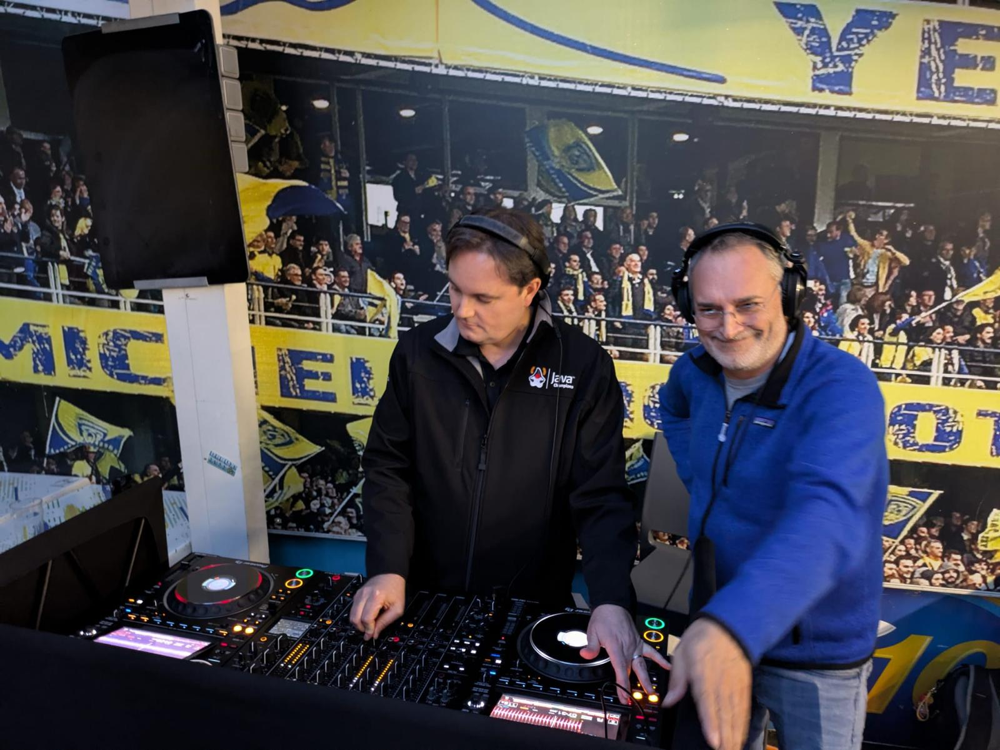

Lots of things have been going on in the background, and posting content to my personal website hasn't been a big priority of the last (few) years!

## From Jekyll to Hugo

I have migrated this website to [Hugo](https://gohugo.io/), a powerful and popular static website generator written in Go. 

[Jekyll](https://jekyllrb.com/) had been my choice for the last decade, but I grew frustrated with the Ruby dependencies management.
At some point I had to stick to old Ruby and gems versions for the setup to work, so I eventually gave up and migrated the website to Hugo.

The mental model of Hugo is not very hard to grasp, but coming from Jekyll there are a few surprises.
Nothing big, though.

I have not imported all of my [posts]() but kept those I thought were still worth a read in 2025.
There is nothing wrong with pruning content from time to time 🙂

## Moving to IBM

As [announced in February 2025](https://www.redhat.com/en/blog/evolving-our-middleware-strategy), I have transferred from Red Hat to IBM.

You can read more about it from [Mark Little's blog](https://markclittle.blogspot.com/2025/03/red-hat-middleware-moving-to-ibm.html).

I am now working for a different company, but on a daily basis nothing has really changed.
We are still working on making modern Java awesome 😎

## Java Champion

In 2024 I became a [Java Champion](https://javachampions.org/).

It's a huge honor 😊

## Volcamp 2025

I had the pleasure to talk about the _"best excuses for not choosing Quarkus"_ at the [Volcamp 2025 conference](https://www.volcamp.io/).
I will try to have more public speaking engagements in the future as this is something I enjoy, but life and the lockdowns years have somehow taken their toll.

I also had the pleasure of being invited by [David Pilato](https://david.pilato.fr/) behind the decks!

It had been 4 years or so since I last did some bedroom DJ-ing, but David was very helpful and friendly, as he always is 🙂
