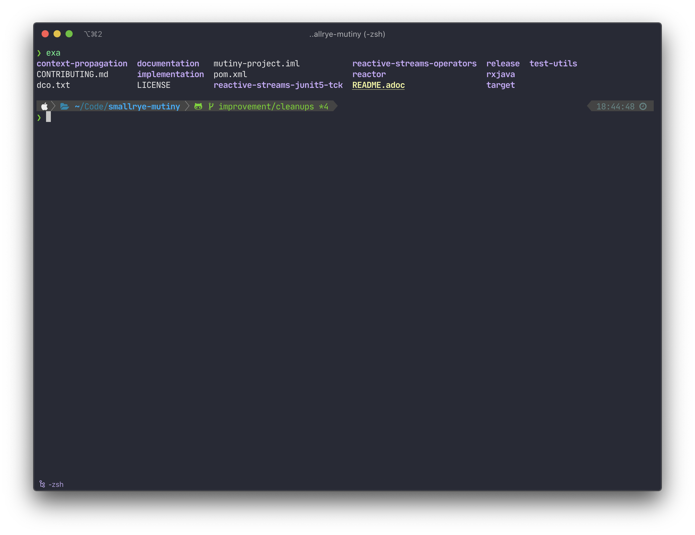
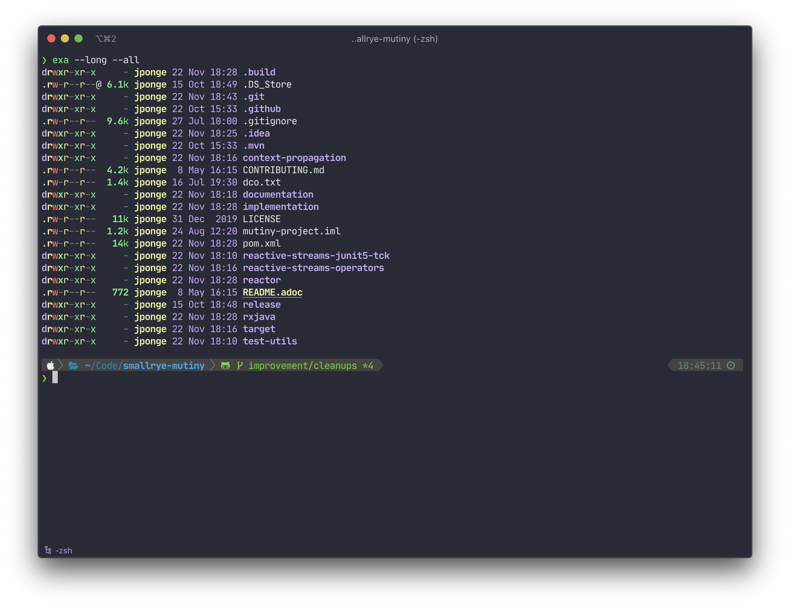
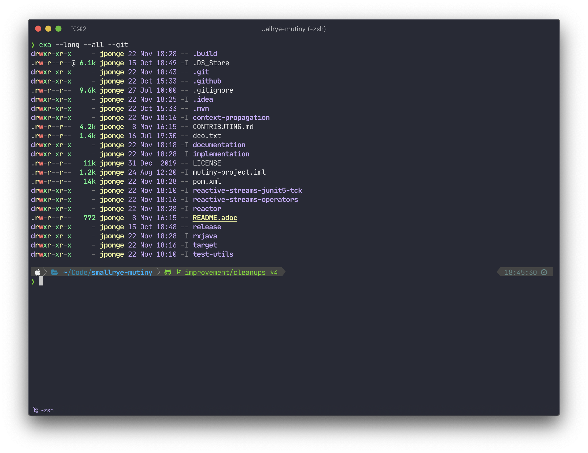
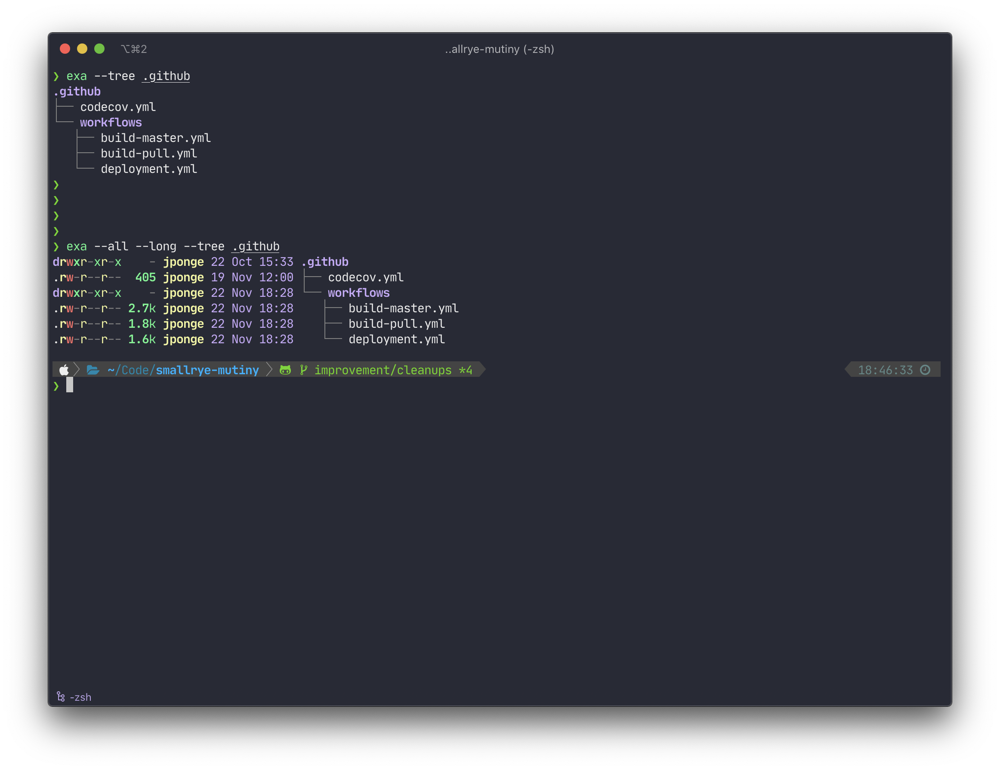
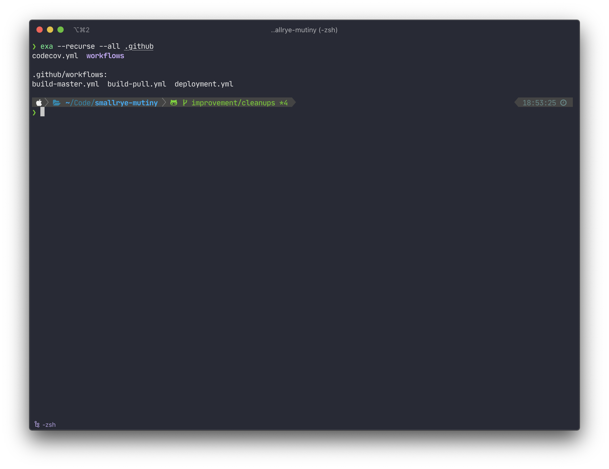

**🚨 Update 2024/09/24**: `exa` is not maintained anymore, use the [eza](https://github.com/eza-community/eza) fork instead.

## Using ~~exa~~ eza as a modern replacement to the venerable Unix ls command

So you know `ls` (often found as `/bin/ls`), the good old Unix command to list files in a directory.

I recently came across [exa](https://the.exa.website), a modern replacement for `ls`. It is part of a wave of new command-line tools written in [Rust](https://www.rust-lang.org) and that bring modernity while staying faithful to the Unix way of writing focused and composable tools.

Of course you may wonder *why* switching from `ls` is any good idea. It turns out that `exa` is really a better `ls`, with good colour support, customisable output, a humane interface and even `git` metadata support (so you can see which files are being ignored, staged, etc).

## A quick tour of ~~exa~~ eza

The default behavior of `eza` is to... list files, pretty much like `ls` would do:



The equivalent of `ls -la` is `eza --long --all`:



Note that by default file sizes are given in a human-friendly form.

If you are in a Git repository you can also get metadata  by adding the `--git` flag to any command:



Note that reading Git metadata can slow down the execution of `eza` commands, so I personally tend to use the `--git` flag only when I actually need it.

You can also inspect trees with the `--tree` flag:



There is also a `--recurse` flag to list files in each directory of the file tree:



## My personal aliases

Typing `eza` instead of `ls` is one more character, and you'll likely have to fight muscle memory. In my case I am trying to get rid of typing `ls -lsa` 😉

You can easily define a few aliases so `eza` becomes your new `ls`. Note that `eza` is not fully compatible with `ls`. For instance `ls -lsa` (which I am fighting) results in an error with `eza -lsa` because the `-s` flag requires an argument to define a sort field.

Here are my personal aliases:

```bash
# A few aliases for eza, a ls replacement
alias l="eza --sort Name"
alias ll="eza --sort Name --long"
alias la="eza --sort Name --long --all"
alias lr="eza --sort Name --long --recurse"
alias lra="eza --sort Name --long --recurse --all"
alias lt="eza --sort Name --long --tree"
alias lta="eza --sort Name --long --tree --all"

alias ls="eza --sort Name"
```

Feel-free to take inspiration and define aliases and default flags that make sense to **you**!