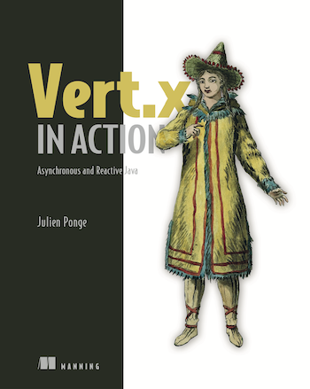

All my publications are being listed here.
[My PhD thesis](phd-thesis/) is an exception as it was worth its own page 🙂

Since it is hard keeping track of everything that was published, you may also find my publications in public repositories:

* [me on DBLP](https://dblp.uni-trier.de/pers/hd/p/Ponge:Julien.html)
* [me on Google Scholar](https://scholar.google.fr/citations?user=IjVOPEAAAAAJ)
* [me on HAL](https://cv.archives-ouvertes.fr/julien-ponge)

## Books

    

Julien Ponge. **Vert.x in Action. Asynchronous and Reactive Java**. Manning Publications. October 2020  ISBN 9781617295621 

## Peer-reviewed international journals ##

* Stéphane Frénot, Frédéric Le Mouël, Julien Ponge and Guillaume Salagnac. **Various Extensions for the Ambient OSGi Framework.** *International Journal of Adaptive, Resilient and Autonomic Systems (IJARAS)*, 2(3):1–12, July 2011. DOI 10.4018/jaras.2011070101. [Link](http://www.igi-global.com/bookstore/article.aspx?titleid=55450).

* Julien Ponge, Boualem Benatallah, Fabio Casati and Farouk Toumani. **Analysis and Applications of Timed Service Protocols.** *ACM Transactions on Software Engineering and Methodology* in vol. 19, issue #4. October 2010. [DOI](http://dx.doi.org/10.1145/1734229.1734230). [PDF of a preliminary version](./preliminary-version-analysis-and-applications-of-timed-service-protocols.pdf).

* Boualem Benatallah, Fabio Casati, Farouk Toumani, Julien Ponge and Hamid Reza Motahari Nezhad. **Service Mosaic: A Model-Driven Framework for Web Services Life-Cycle Management.** *IEEE Internet Computing*, vol. 10, no. 4, pp. 55-63, July/August, 2006. [PDF](./servicemosaic-internet-computing-2006.pdf)

## International peer-reviewed conferences ##

* Arthur Navarro, Julien Ponge, Frédéric Le Mouël, and Clément Escoffier. **Considerations for integrating virtual threads in a Java framework: a Quarkus example in a resource-constrained environment.** *DEBS'23 (17th ACM International Conference on Distributed and Event-based Systems)*, June 2023, New-York, NY, USA. [DOI](https://dl.acm.org/doi/10.1145/3583678.3596895) [HAL entry](https://inria.hal.science/hal-04112339)

* Julien Ponge and Mark Little. **Scalability and resilience in practice: current trends and opportunities**. *SRDS 2019 (38th International Symposium on Reliable Distributed Systems)*, October 2019, Lyon, France. [PDF](./srds-jpml19.pdf)

* Roya Golchay, Frédéric Le Mouël, Julien Ponge and Nicolas Stouls. **Spontaneous Proximity Clouds: Making Mobile Devices to Collaborate for Resource and Data Sharing**. *CollaborateCom 2016*, November 2016, Beijing, China. [HAL entry](https://hal.inria.fr/hal-01391114)

* Roya Golchay, Frédéric Le Mouël, Julien Ponge and Nicolas Stouls. **Automated application offloading through ant-inspired decision-making**. *NOTERE 2016*, July 2016, Paris, France. [HAL entry](https://hal.inria.fr/hal-01391082v2)

* Stefan-Gabriel Chitic, Julien Ponge and Olivier Simonin. **SDfR - Service discovery for multi-robot systems**. *ICAART 2016: The 8th International Conference on Agents and Artificial Intelligence*, Feb 2016, Rome, Italy. [HAL entry](https://hal.inria.fr/hal-01286895)

* Stefan-Gabriel Chitic, Julien Ponge and Olivier Simonin. **Are Middlewares Ready for Multi-robots Systems?** *In Proceedings of Simulation, Modeling, and Programming for Autonomous Robots - 4th International Conference, SIMPAR 2014*. Bergamo, Italy, October 20-23, 2014. [DOI](http://dx.doi.org/10.1007/978-3-319-11900-7_24)

* Julien Ponge, Frédéric Le Mouël, and Nicolas Stouls. **Golo, a Dynamic, Light and Efficient Language for Post-InvokeDynamic JVM.** *In Proceedings of the 2013 International Conference on Principles and Practices of Programming on the Java Platform: Virtual Machines, Languages, and Tools ([PPPJ'13](http://pppj2013.dhbw.de/conference-pppj2013.html)).* Stuttgart, Germany. September 2013. [DOI](http://dx.doi.org/10.1145/2500828.2500844). [PDF](./golo-pppj13.pdf)

* Stéphane Frénot and Julien Ponge. **LogOS: an Automatic Logging Framework for Service-Oriented Architectures.** *In the 38th Euromicro Conference on Software Engineering and Advanced Applications (2012)*. Izmir, Turkey. September 2012. [HAL entry](http://hal.inria.fr/hal-00709534).

* Herman Mekontso, Julien Ponge, Yufang Dan and Nicolas Stouls. **An API for Autonomous and Client-side Service Substitution.** *In The Fourth International Conferences on Advanced Service Computing (2012).* Nice, France. July 2012. [HAL entry](http://hal.inria.fr/hal-00695826)

* Stéphane Frénot, Noha Ibrahim, Frédéric Le Mouel, Amira Ben Hamida, Julien Ponge, Mathieu Chantrel and Denis Beras. **ROCS: a Remotely Provisioned OSGi Framework for Ambient Systems.** *In Network Operations and Management Symposium (NOMS 2010).* Osaka, Japan. April 2010. [PDF](./noms2010.pdf).

* Julien Ponge, Farouk Toumani, Boualem Benatallah and Fabio Casati. **Fine-grained Compatibility and Replaceability Analysis of Timed Web Service Protocols.** *In the 26th International Conference on Conceptual Modeling (ER).* Auckland, New Zealand. November 2007. LNCS Vol. 4801 Copyright © Springer-Verlag Berlin Heidelberg 2007. [PDF](./er07-extended.pdf). [Slides](./slides-er07.pdf). [Extended version](./er07-extended.pdf).

* Boualem Benatallah, Fabio Casati, Julien Ponge and Farouk Toumani. **On Temporal Abstractions of Web Services Protocols.** *Procs of CAiSE Forum 2005.* Porto, Portugal. Jun 2005. [PDF](./FORUM_07.pdf). [Poster](./Poster-CAiSE05.pdf).

## International peer-reviewed workshops ##

* Julien Ponge, Arthur Navarro, Clément Escoffier, and Frédéric Le Mouël. 2021. **Analysing the Performance and Costs of Reactive Programming Libraries in Java**. *In Proceedings of the 8th ACM SIGPLAN International Workshop on Reactive and Event-Based Languages and Systems ([REBLS ’21](https://2021.splashcon.org/home/rebls-2021)), October 18, 2021, Chicago, IL, USA. ACM, New York, NY, USA, 10 pages.* [DOI](https://doi.org/10.1145/3486605.3486788) [PDF](./reactive-libraries-rebls21.pdf)

* Patrik Fortier, Frédéric Le Mouël, and Julien Ponge. 2021. **Dyninka: a FaaS framework for distributed dataflow applications**. *In Proceedings of the 8th ACM SIGPLAN International Workshop on Reactive and Event-Based Languages and Systems ([REBLS ’21](https://2021.splashcon.org/home/rebls-2021)), October 18, 2021, Chicago, IL, USA. ACM, New York, NY, USA.* [PDF](./dyninka-rebls21.pdf)

* Patrik Fortier, Julien Ponge and Frédéric Le Mouël. **Dyninka: a framework for distributed FaaS dataflow.** Fifth Annual UK System Research Challenges Workshop, March 2020, Newton Aycliffe, United Kingdom. [HAL entry](https://hal.archives-ouvertes.fr/hal-02915715)

* Baptiste Maingret, Frédéric Le Mouël, Julien Ponge, Nicolas Stouls, Jian Cao and Yannick Loiseau. **Towards a Decoupled Context-Oriented Programming Language for the Internet of Things**. *In Proceedings of the 7th International Workshop on Context-Oriented Programming ([COP'2015](http://2015.ecoop.org/track/COP-2015-papers)) in conjunction with the European Conference on Object-Oriented Programming (ECOOP'2015).* Prague, Czech Republic, July 2015.

* Roya Golchay, Frédéric Le Mouël, Stéphane Frénot and Julien Ponge. **Towards Bridging IoT and Cloud Services: Proposing Smartphones as Mobile and Autonomic Service Gateways.** *In Actes des 7ème Journées Francophones de la Mobilité et Ubiquité (UbiMob'2011)*, pp. 45–48, Toulouse, France, June 2011. Position Paper. [PDF](./UbiMob2011.pdf)

* Hamid Motahari, Regis Saint-Paul, Boualem Benatallah, Fabio Casati, Julien Ponge and Farouk Toumani. **ServiceMosaic: Interactive Analysis and Manipulations of Service Conversations.** *In International Conference on Data Engineering (ICDE’07).* Istanbul, Turkey. April 2007. [PDF](./icde07.pdf).

* Julien Ponge, **A New Model For Web Services Timed Business Protocols.** [*Atelier “Conception des systemes d’information et services Web”*](http://sisw06.loria.fr/) - Conference INFORSID. Hammamet, Tunisia, May 2006.

* Julien Ponge, **Modeling and Analysing Web Services Protocols.** [*IBM PhD Student Symposium at ICSOC 2005.*](http://ftp.informatik.rwth-aachen.de/Publications/CEUR-WS/Vol-169/). Amsterdam, The Netherlands, Dec 2005.

## National peer-reviewed conferences ##

* Oscar Carrillo, Nicolas Stouls, Raphael Laurent, Nikolai Plokhoi, Qifan Zhou, Julien Ponge and Frédéric Le Mouël. **HardenedGolo : pour augmenter le niveau de confiance en un code Golo**. *16èmes journées sur les Approches Formelles dans l'Assistance au Développement de Logiciels (AFADL'17)*. Montpellier, France. June 2017. [HAL entry](https://hal.inria.fr/hal-01526659)

* Stefan-Gabriel Chitic, Julien Ponge and Olivier Simonin. **SDfR protocol : Service Discovery for Robots.** *Journée sur les Architectures Logicielles pour la Robotique Autonome, les Systèmes Cyber-Physiques et les Systèmes Auto-Adaptables.* Paris, France, December 2014.

* Stefan-Gabriel Chitic, Julien Ponge and Olivier Simonin. **Intergiciels pour systèmes multi-robots: état de l'art.** *In Proceedings of UbiMob2014 : 10èmes journées francophones Mobilité et Ubiquité*. Sophia Antipolis. France, June 2014. [HAL entry](http://hal.archives-ouvertes.fr/hal-00994810)

* Julien Ponge and Frédéric Le Mouël. **JooFlux : modification de code à chaud et injection d'aspects directement dans une JVM 7**. *In Proceedings of Conférence d'informatique en Parallélisme, Architecture et Système (ComPAS) - Conférence Française en Systèmes d'Exploitation (CFSE)*. Grenoble, France. January 2013. [HAL entry](http://hal.inria.fr/hal-00759402). [Slides](https://speakerdeck.com/jponge/jooflux-at-compas-2013).

* Boualem Benatallah, Fabio Casati, Julien Ponge, Farouk Toumani. **Compatibility and replaceability analysis for timed web service protocols.** *Procs of BDA 2005*. Saint-Malo, France. Oct 2005. [PDF](./bda05-BCPT.pdf). [Slides](./slides-bda05-BCPT.pdf).

## Invited papers ##

* Stéphane Frénot, Frédéric Le Mouel, Julien Ponge and Guillaume Salagnac. **Various Extensions for the Ambient OSGi Framework.** *In Proceedings of the 4th International workshop on Adaptive and DependAble Mobile Ubiquitous Systems (ADAMUS'2010) in conjunction with the ACM International Conference on Pervasive Services (ICPS'2010).* Berlin, Germany, July 2010. [HAL entry](http://hal.inria.fr/inria-00515189/)

## Preprints / research reports ##

* Julien Ponge, Frédéric Le Mouël, Nicolas Stouls and Yannick Loiseau. **Opportunities for a Truffle-based Golo Interpreter**. Research report, 2015. [arXiv 1505.06003](http://arxiv.org/abs/1505.06003).

* Julien Ponge and Frédéric Le Mouël. **JooFlux: Hijacking Java 7 InvokeDynamic To Support Live Code Modifications**. Research report, 2012. [arXiv 1210.1039](http://arxiv.org/abs/1210.1039).

* Herman Albert Mekontso Tchinda, Nicolas Stouls and Julien Ponge. **Spécification et substitution de services OSGi**. INRIA RR-7733, 2011. [HAL entry](http://hal.inria.fr/inria-00619233/en/)

* Cédric Lauradoux, Julien Ponge and Andrea Roeck. **Online Entropy Estimation for Non-Binary Sources and Applications on iPhone**. INRIA RR-7663, 2011. [HAL entry](http://hal.inria.fr/inria-00604857/en/)

## Peer-reviewed technical articles ##

* Clement Escoffier, Julien Ponge. **Going Reactive with Eclipse Vert.x and RxJava**. *Oracle Java Magazine Jan/Feb 2018*.

* Julien Ponge. **Golo -- A fast, low-ceremony, easy-to-learn language for the JVM**. *Oracle Java Magazine March/April 2016*.

* Julien Ponge. **Avoiding Benchmarking Pitfalls on the JVM**. *Oracle Java Magazine July/August 2014*, Oracle Corporation.

* Julien Ponge. **Oracle Nashorn: A Next-Generation JavaScript Engine for the JVM**. *Oracle Java Magazine January/February 2014*, Oracle Corporation.

* Julien Ponge. **Demystifying invokedynamic (part 2)**. *Oracle Java Magazine May/June 2013*, Oracle Corporation.

* Julien Ponge. **Demystifying invokedynamic (part 1)**. *Oracle Java Magazine January/February 2013*, Oracle Corporation.

* Julien Ponge. **New File System APIs in NIO.2: A Walkthrough**. *Oracle Java Magazine September/October 2012*, Oracle Corporation.

* Julien Ponge. **Project Coin: The Java Language Has Evolved! (part 2)**. *Oracle Java Magazine March/April 2012*, Oracle Corporation. 

* Julien Ponge. **Clustering and High Availability Made Simple with GlassFish (part 2)**. *Oracle Java Magazine March/April 2012*, Oracle Corporation. 

* Julien Ponge. **Adding Some Agility to Java EE Application Deployment with GlassFish**. *Oracle Technology Network*, Oracle Corporation. February 2012.

* Julien Ponge. **Project Coin: The Java Language Has Evolved! (part 1)**. *Oracle Java Magazine January/February 2012*, Oracle Corporation.

* Julien Ponge. **Clustering and High Availability Made Simple with GlassFish (part 1)**. *Oracle Java Magazine January/February 2012*, Oracle Corporation.

* Julien Ponge. **Fork and Join: Java Can Excel at Painless Parallel Programming Too!**. *Oracle Technology Network*, Oracle Corporation. July 2011.

* Julien Ponge. **Better Resource Management with Java SE 7: Beyond Syntactic Sugar**. *Oracle Technology Network*, Oracle Corporation. May 2011.
